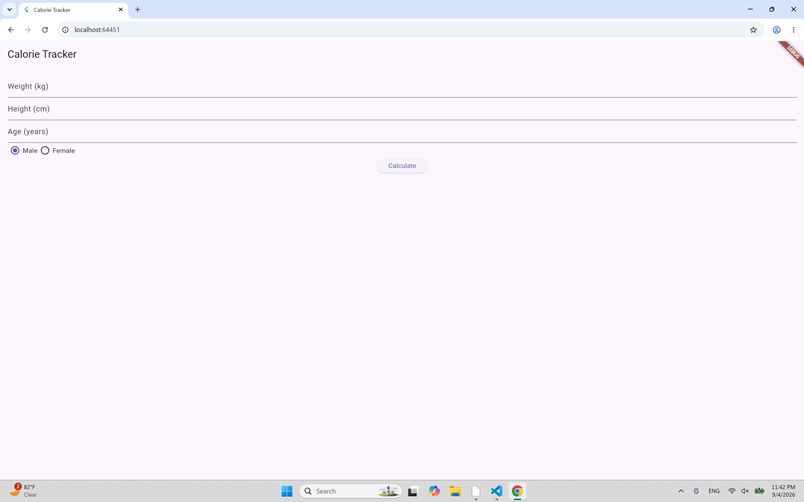
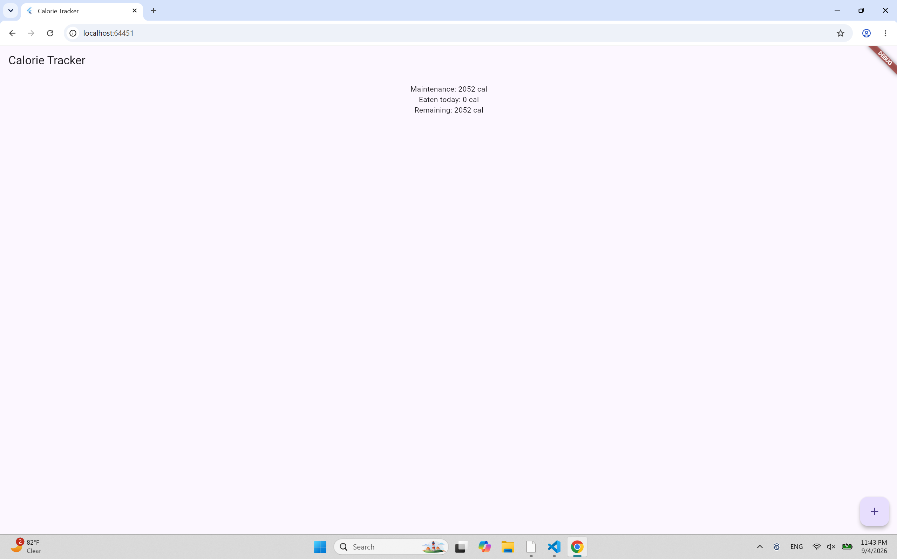
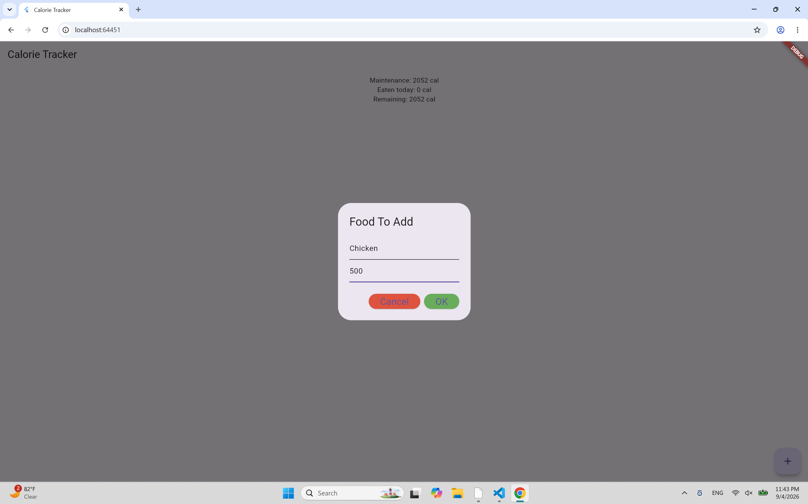
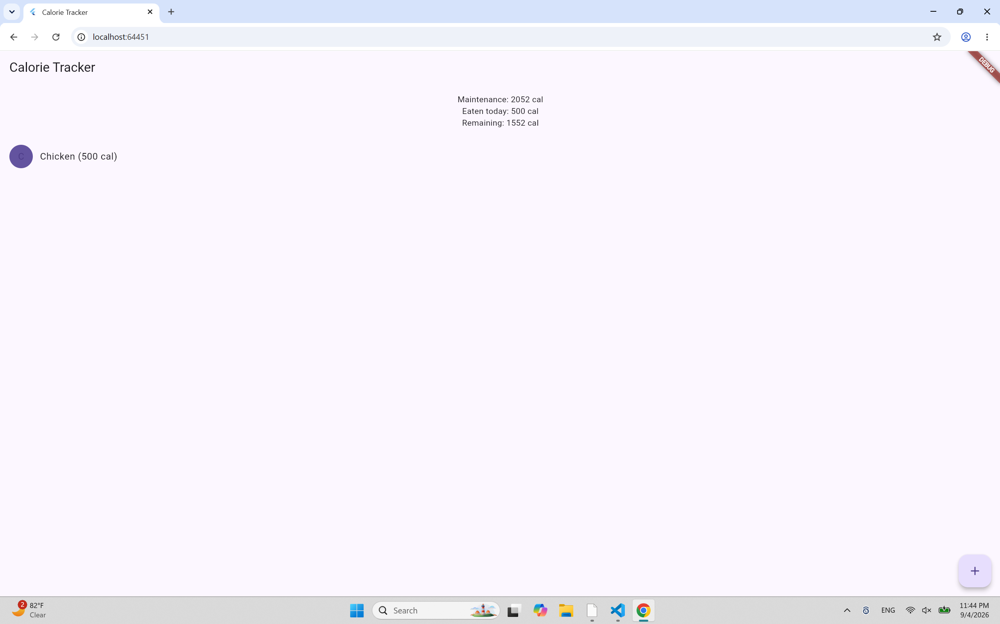

# Calorie Tracker

A simple Flutter app for estimating your daily calories and keeping track of what you eat.

## Who is this for?

Anyone who wants a quick way to check their daily maintenance calories and log meals throughout the day — no accounts, no ads, no complicated nutrition database to search through.

## What does it do?

You enter your weight, height, age, and sex once and the app calculates the number of calories you need per day to maintain your current weight. From there you can log each food you eat along with its calorie count, and the app keeps a running total of calories eaten versus calories remaining for the day.

## Why is it useful?

Most calorie-tracking apps come bundled with subscriptions, ads and complicated features you may not want. This app is fast to open, fast to use, and easy to understand.

## Screenshots

## Features

- Calculates maintenance calories using the Mifflin-St Jeor equation
- Log food items with a name and calorie count
- Running total of calories eaten vs. remaining for the day
- Long-press a food entry to delete it

## License

See [LICENSE](LICENSE) for details.
